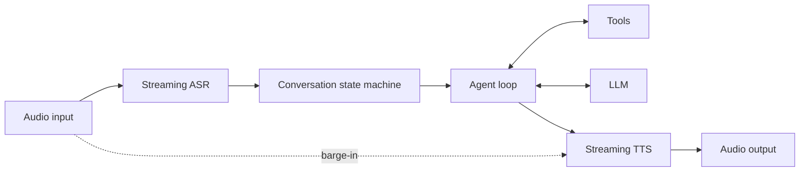

# ByteTurn

ByteTurn is a C++ runtime for low-latency, voice-first agents. It connects
streaming ASR, an LLM tool loop, and streaming TTS behind small provider
interfaces. The name describes a continuous exchange of audio bytes rather than
rigid request/response turns.

## Architecture



The agent harness is deliberately small and explicit: conversation history is
owned by `Agent`, tools are invoked by `ToolRegistry`, and providers do not leak
vendor SDK types into the core. `Conversation` owns the listening/thinking/
speaking state and cancels stale TTS output when the user interrupts.

This layering follows the service boundaries documented by
[MiniMax Code](https://github.com/MiniMax-AI/minimax-code/blob/main/docs/architecture.md),
adapted for continuous audio. See [docs/architecture.md](docs/architecture.md)
for the mapping and planned production services. No MiniMax Code source is
copied into this repository.

## Build and run

No third-party dependency is required for the demo:

```bash
make test
make
./build/byteturn_cli
```

Or use CMake 3.20+:

```bash
cmake -S . -B build
cmake --build build
ctest --test-dir build
```

Try `echo hello` in the CLI to exercise one structured tool call. The bundled
providers are intentionally fake; real ASR, LLM, and TTS adapters are the next
integration layer.

## Runtime APIs

- `SessionExecutor` runs turns asynchronously: turns in one session are FIFO
  and never overlap, while independent sessions can use separate workers.
- `AsyncSession` binds an `Agent` and its mutable history to one executor lane;
  cancellation is cooperative through `CancellationToken`.
- `EventBus` emits sequenced transcript, turn, model, tool, speech, audio,
  cancellation, and error events. Subscriber failures are isolated.
- `OpenAiCompatibleLlm` implements `POST /chat/completions`, including function
  tool definitions, assistant tool calls, and matching `tool_call_id` results.
  Inject an `HttpTransport` backed by the HTTP client used by your application.

The adapter deliberately does not ship a TLS/HTTP stack. It can therefore use
libcurl, an internal client, or a platform transport without adding that choice
to ByteTurn's core ABI.

`CurlHttpTransport` is the production transport supplied by this repository. It
defaults to verified HTTPS, a 3-second connect timeout, a 30-second request
timeout, an 8 MiB response limit, no redirect following, and up to three
attempts for transient connection failures, `408`, `429`, and selected `5xx`
responses. It honors `Retry-After` with capped exponential jitter and connects
session cancellation to libcurl's progress callback. Each worker thread reuses
its curl handle and connection cache, avoiding a fresh TCP/TLS handshake for
every model turn.

```cpp
byteturn::MetricsRegistry metrics;
byteturn::CurlTransportConfig network;
network.metrics = &metrics;
byteturn::CurlHttpTransport http(network);

byteturn::OpenAiCompatibleConfig model;
model.base_url = "https://api.openai.com/v1";
model.api_key = std::getenv("OPENAI_API_KEY");
model.model = "your-model";
byteturn::OpenAiCompatibleLlm llm(model, http);
```

Attach `RuntimeObserver` to an `EventBus` for counters and latency histograms,
then expose `MetricsRegistry::prometheus_text()` from the application's metrics
endpoint. `JsonEventLogger` writes correlated JSON lines and excludes event
payloads by default to avoid logging transcripts, prompts, and tool data.

### Latency metrics

| Metric | Start | End |
|---|---|---|
| `byteturn_conversation_turn_duration_ms` | input end-of-utterance | incremental TTS synthesis completed |
| `byteturn_asr_final_latency_ms` | input end-of-utterance | final transcript callback |
| `byteturn_time_to_first_token_ms` | LLM request starts | first non-empty text delta |
| `byteturn_model_duration_ms` | LLM request starts | SSE stream/model response completes |
| `byteturn_tts_first_audio_latency_ms` | first sentence submitted to TTS | first audio frame produced |
| `byteturn_tts_total_duration_ms` | first sentence submitted to TTS | final TTS chunk completes |
| `byteturn_s2s_first_audio_latency_ms` | input end-of-utterance | first output audio frame produced |
| `byteturn_provider_first_packet_ms` | logical HTTP request, including retries | first response body bytes |
| `byteturn_provider_request_duration_ms` | logical HTTP request, including backoff | successful response completes |

ASR and S2S metrics require the input `AudioFrame::end_of_utterance` marker.
“First audio” means the first frame delivered to the application audio sink;
device buffering and physical playout are outside the runtime measurement.

## Streaming speech pipeline

`OpenAiCompatibleLlm::stream` incrementally parses SSE across arbitrary network
chunk boundaries and reassembles indexed tool-call fragments. Text deltas flow
through `SentenceSegmenter`, which supports English and CJK terminal punctuation,
soft punctuation thresholds, and a hard maximum chunk size. A bounded
`IncrementalTtsPipeline` synthesizes completed sentences on a separate worker so
TTS can overlap continued LLM generation without unbounded buffering.

## Repository layout

- `include/byteturn/`: stable public interfaces and state machine
- `src/`: provider-independent harness implementation
- `apps/`: runnable examples
- `tests/`: dependency-free unit tests

## Design priorities

1. First-class barge-in and cancellation rather than treating voice as text I/O.
2. Vendor-neutral provider interfaces for independent ASR/LLM/TTS selection.
3. A bounded, observable tool loop to prevent runaway agent execution.
4. CPU-friendly audio transport with later support for bounded queues and RTC.

## Next milestones

- Bounded audio queues and back-pressure for realtime audio threads.
- Streaming Chat Completions decoding and retry/rate-limit policy.
- Streaming ASR/TTS adapters and end-of-utterance policy.
- Metrics for ASR final latency, time-to-first-token, time-to-first-audio, and
  interruption stop latency.
- WebSocket/RTC transport plus integration and latency tests.

## License

Apache-2.0. See `LICENSE`.
