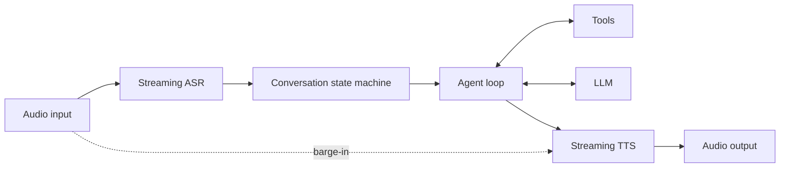

# ByteTurn

ByteTurn is a C++ runtime for low-latency, voice-first agents. It connects
streaming ASR, an LLM tool loop, and streaming TTS behind small provider
interfaces. The name describes a continuous exchange of audio bytes rather than
rigid request/response turns.

## Architecture



The agent harness is deliberately small and explicit: conversation history is
owned by `Agent`, tools are invoked by `ToolRegistry`, and providers do not leak
vendor SDK types into the core. `Conversation` owns the listening/thinking/
speaking state and cancels stale TTS output when the user interrupts.

This layering follows the service boundaries documented by
[MiniMax Code](https://github.com/MiniMax-AI/minimax-code/blob/main/docs/architecture.md),
adapted for continuous audio. See [docs/architecture.md](docs/architecture.md)
for the mapping and planned production services. No MiniMax Code source is
copied into this repository.

## Build and run

No third-party dependency is required for the demo:

```bash
make test
make
./build/byteturn_cli
```

Or use CMake 3.20+:

```bash
cmake -S . -B build
cmake --build build
ctest --test-dir build
```

Try `echo hello` in the CLI to exercise one structured tool call. The bundled
providers are intentionally fake; real ASR, LLM, and TTS adapters are the next
integration layer.

## Repository layout

- `include/byteturn/`: stable public interfaces and state machine
- `src/`: provider-independent harness implementation
- `apps/`: runnable examples
- `tests/`: dependency-free unit tests

## Design priorities

1. First-class barge-in and cancellation rather than treating voice as text I/O.
2. Vendor-neutral provider interfaces for independent ASR/LLM/TTS selection.
3. A bounded, observable tool loop to prevent runaway agent execution.
4. CPU-friendly audio transport with later support for bounded queues and RTC.

## Next milestones

- Async session executor and back-pressure for realtime audio threads.
- OpenAI-compatible LLM adapter and JSON tool schema.
- Streaming ASR/TTS adapters and end-of-utterance policy.
- Metrics for ASR final latency, time-to-first-token, time-to-first-audio, and
  interruption stop latency.
- WebSocket/RTC transport plus integration and latency tests.

## License

Apache-2.0. See `LICENSE`.
