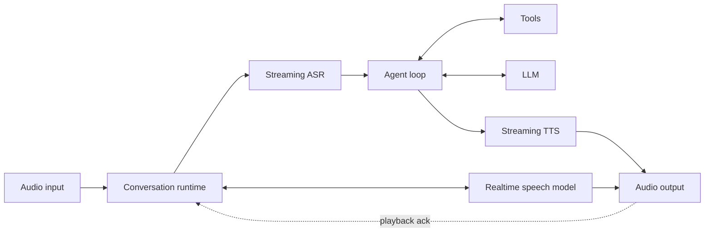

# RealFlow

RealFlow (originally ByteTurn) is a C++ runtime for low-latency, voice-first agents. It supports both
streaming ASR/LLM/TTS cascades and native, full-duplex speech-to-speech models
behind small provider interfaces. This initial release retains the `byteturn`
C++ namespace, include paths, and build targets for compatibility.

The imported ByteTurn code retains its MIT license (see `LICENSE-ByteTurn`).
The repository's existing Apache-2.0 `LICENSE` is preserved; importing the code
does not replace its original MIT license.

## Architecture



The agent harness is deliberately small and explicit: conversation history is
owned by `Agent`, tools are invoked by `ToolRegistry`, and providers do not leak
vendor SDK types into the core. `Conversation` owns the listening/thinking/
speaking state and cancels stale TTS output when the user interrupts.

This layering follows the service boundaries documented by
[MiniMax Code](https://github.com/MiniMax-AI/minimax-code/blob/main/docs/architecture.md),
adapted for continuous audio. See [docs/architecture.md](docs/architecture.md)
for the mapping and planned production services. No MiniMax Code source is
copied into this repository.

## Build and run

The runtime requires libcurl for the production HTTP transport:

```bash
make test
make
./build/byteturn_cli
```

Or use CMake 3.20+:

```bash
cmake -S . -B build
cmake --build build
ctest --test-dir build
```

Try `echo hello` in the CLI to exercise one structured tool call. The bundled
providers are intentionally fake; real ASR, LLM, and TTS adapters are the next
integration layer.

## Runtime APIs

### Offline mock providers

Include `byteturn/mock_providers.h` to inject reusable `MockAsrProvider`,
`MockLlmProvider`, and `MockTtsProvider` through the existing provider interfaces.
No credentials, network calls, sleeps, or additional worker threads are needed.
The normal build still links libcurl for the production transport.

```sh
make test-mocks
./build/mock_pipeline_demo
```

The demo runs the actual session/pipeline, ASR ingress, agent streaming, sentence
segmentation and incremental TTS, then verifies completion and metric endpoints.
Its PCM is silence, not intelligible speech; its timings are not provider benchmarks.

```cpp
byteturn::MockAsrProvider asr({{{"Hel"}, "Hello."}});
byteturn::MockLlmProvider llm({{{"Hello ", "from RealFlow."}, {}}});
byteturn::MockTtsProvider tts; // One 160-sample, 16 kHz mono silence frame/chunk.
```

- ASR: nonempty input frames advance scripted partials; an `end_of_utterance`
  frame emits the final and advances to the next utterance, even with empty PCM.
  Exhaustion is silent; `reset()` rewinds the script, not a callback-drain barrier.
- LLM: each call consumes one scripted reply, with ordered text deltas and optional
  structured tool calls. History is ignored; exhaustion throws. Pre-cancellation
  consumes nothing; cancellation after selection, sink rejection or callback failure
  consumes that reply and throws. Complete and streaming share this behavior.
- TTS: supplied owned PCM frames replay for each nonempty text chunk. Empty frame
  lists emit nothing; malformed PCM metadata/interleaving is rejected. A false sink
  return stops delivery. `cancel()` is thread-safe and cooperative; incremental
  chunks remain cancelled until `begin_utterance()`. Standalone `synthesize()` starts
  a new utterance. Serialize begin/synthesis/end; cancellation may race them, and
  an already-entered callback may finish.

Scripts are finite, constructor-owned fixtures with no retained input history or
growing request logs. Callbacks are synchronous and never retained. Keep providers
alive until their calling session has fully stopped; normally use one set per session.

### Core APIs

- `SessionExecutor` runs turns asynchronously: turns in one session are FIFO
  and never overlap, while independent sessions can use separate workers. Both
  global and per-session pending queues are bounded.
- `AsyncSession` binds an `Agent` and its mutable history to one executor lane;
  cancellation and deadlines are cooperative through `TurnContext`.
- `Conversation` copies audio into a bounded queue and runs ASR on its own
  worker. Final transcripts only enqueue turns; audio/ASR callback threads never
  execute LLM, tool, or TTS work.
- `EventBus` emits sequenced transcript, turn, model, tool, speech, audio,
  cancellation, and error events. Subscriber failures are isolated.
- `FullDuplexConversation` keeps microphone upload and model output active at
  the same time. `RealtimeSpeechProvider` adapters expose native audio sessions
  without leaking vendor SDK types into the runtime.
- `OpenAiCompatibleLlm` implements `POST /chat/completions`, including function
  tool definitions, assistant tool calls, and matching `tool_call_id` results.
  Inject an `HttpTransport` backed by the HTTP client used by your application.

The adapter deliberately does not ship a TLS/HTTP stack. It can therefore use
libcurl, an internal client, or a platform transport without adding that choice
to ByteTurn's core ABI.

`CurlHttpTransport` is the production transport supplied by this repository. It
defaults to verified HTTPS, a 3-second connect timeout, a 30-second request
timeout, an 8 MiB response limit, no redirect following, and up to three
attempts for transient connection failures, `408`, `429`, and selected `5xx`
responses. It honors `Retry-After` with capped exponential jitter and connects
session cancellation to libcurl's progress callback. Each worker thread reuses
its curl handle and connection cache, avoiding a fresh TCP/TLS handshake for
every model turn.

```cpp
byteturn::MetricsRegistry metrics;
byteturn::CurlTransportConfig network;
network.metrics = &metrics;
byteturn::CurlHttpTransport http(network);

byteturn::OpenAiCompatibleConfig model;
model.base_url = "https://api.openai.com/v1";
model.api_key = std::getenv("OPENAI_API_KEY");
model.model = "your-model";
byteturn::OpenAiCompatibleLlm llm(model, http);
```

Attach `RuntimeObserver` to an `EventBus` for counters and latency histograms,
then expose `MetricsRegistry::prometheus_text()` from the application's metrics
endpoint. `JsonEventLogger` writes correlated JSON lines and excludes event
payloads by default to avoid logging transcripts, prompts, and tool data.

### Latency metrics

| Metric | Start | End |
|---|---|---|
| `byteturn_conversation_turn_duration_ms` | input end-of-utterance | incremental TTS synthesis completed |
| `byteturn_asr_final_latency_ms` | input end-of-utterance | final transcript callback |
| `byteturn_time_to_first_token_ms` | LLM request starts | first non-empty text delta |
| `byteturn_model_duration_ms` | LLM request starts | SSE stream/model response completes |
| `byteturn_tts_first_audio_latency_ms` | first sentence submitted to TTS | first audio frame produced |
| `byteturn_tts_total_duration_ms` | first sentence submitted to TTS | final TTS chunk completes |
| `byteturn_s2s_first_audio_latency_ms` | input end-of-utterance | first output audio frame produced |
| `byteturn_s2s_first_audible_latency_ms` | input speech ended | client reports playback started |
| `byteturn_barge_in_stop_latency_ms` | barge-in detected | cancellation/truncation submitted |
| `byteturn_provider_first_packet_ms` | logical HTTP request, including retries | first response body bytes |
| `byteturn_provider_request_duration_ms` | logical HTTP request, including backoff | successful response completes |

ASR and S2S metrics require the input `AudioFrame::end_of_utterance` marker.
“First audio” means the first frame delivered to the application audio sink.
For a full-duplex session, the transport/player should call
`playback_started()` and `acknowledge_playback()` so ByteTurn can separately
measure audible latency and truncate interrupted model context at the last
sample the user actually heard.

## Native full-duplex pipeline

Create a `RealtimeSpeechProvider` adapter for the selected bidirectional model,
then construct `FullDuplexConversation`. The provider pushes transcripts,
response lifecycle events, and audio deltas into the supplied event callback.
The application continuously submits microphone frames and acknowledges audio
playout using the response ID and monotonic sample offsets in `DuplexAudio`.

On input speech start, ByteTurn immediately:

1. marks a barge-in without stopping microphone upload;
2. rejects late audio for the interrupted response;
3. asks the provider to cancel generation; and
4. truncates provider context to `played_samples`, not downloaded samples.

This makes echo cancellation/VAD and physical playback ownership explicit:
ByteTurn does not guess from arbitrary microphone energy or network delivery.

## Streaming speech pipeline

`OpenAiCompatibleLlm::stream` incrementally parses SSE across arbitrary network
chunk boundaries and reassembles indexed tool-call fragments. Text deltas flow
through `SentenceSegmenter`, which supports English and CJK terminal punctuation,
soft punctuation thresholds, and a hard maximum chunk size. A bounded
`IncrementalTtsPipeline` synthesizes completed sentences on a separate worker so
TTS can overlap continued LLM generation without unbounded buffering.

Every cascaded turn carries one `TurnContext` containing its session ID, turn
ID, trace ID, deadline, cancellation token, and lifecycle state. Queue waiting
consumes the same deadline budget as model and tool work. Cancellable tools
receive a `stop_requested` callback and incomplete turns roll history back to
the pre-turn checkpoint.

## Repository layout

- `include/byteturn/`: stable public interfaces and state machine
- `src/`: provider-independent harness implementation
- `apps/`: runnable examples
- `tests/`: dependency-free unit tests

## Design priorities

1. First-class barge-in and cancellation rather than treating voice as text I/O.
2. Vendor-neutral provider interfaces for independent ASR/LLM/TTS selection.
3. A bounded, observable tool loop to prevent runaway agent execution.
4. CPU-friendly audio transport with later support for bounded queues and RTC.

## Next milestones

- OpenAI Realtime and Gemini Live WebSocket provider adapters.
- RTC/WebSocket transport with playback acknowledgements and jitter metrics.
- Acoustic echo cancellation and pluggable client/server VAD policy.
- Network-fault integration tests for reconnect and session resumption.

## License

Apache-2.0. See `LICENSE`.
